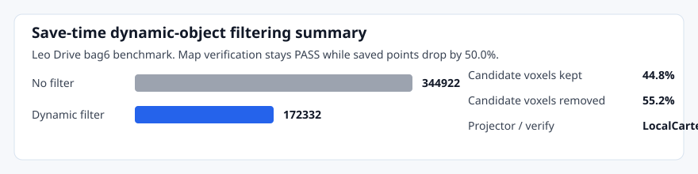

# lidarslam_ros2

[](https://github.com/rsasaki0109/lidarslam_ros2/actions/workflows/main.yml)
[](https://opensource.org/licenses/BSD-2-Clause)
[](#support-matrix)

**ROS 2 LiDAR SLAM that produces Autoware-compatible pointcloud maps without a GPL frontend.**

Drop in a rosbag2, get back a `pointcloud_map/` directory Autoware can load, with optional lanelet2, GNSS georeferencing, and a working AWSIM → Autoware autonomous-driving demo on the map you just built.


> Live `/map/pointcloud_map` rendered by Autoware map loaders. `map_verify: PASS`, `LocalCartesian` from GNSS.

---

## ⚡ Try It in 5 Minutes

```bash
# 1. Clone with submodules
cd ~/ros2_ws/src
git clone --recursive https://github.com/rsasaki0109/lidarslam_ros2.git
cd .. && rosdep install --from-paths src --ignore-src -r -y

# 2. Build
colcon build --symlink-install --cmake-args -DCMAKE_BUILD_TYPE=Release
source install/setup.bash

# 3. Run the public quickstart (NTU VIRAL tnp_01, ~580 s outdoor bag)
cd src/lidarslam_ros2
bash scripts/download_ntu_viral_tnp01.sh
bash scripts/run_autoware_quickstart.sh
```

Expected output: `output/.../pointcloud_map/` (Autoware-compatible) plus a TUM trajectory. To verify:

```bash
python3 scripts/verify_autoware_map.py output/.../pointcloud_map
# expect: map_verify: PASS
```

Got your own rosbag2?

```bash
bash scripts/run_autoware_map_beginner.sh /path/to/rosbag2
```

---

## 🎯 What You Can Do With This

### 🗺️ Pointcloud-Map Authoring (Autoware-compatible)
- `RKO-LIO` frontend + `graph_based_slam` backend, both non-GPL
- Outputs Autoware `pointcloud_map/` + `map_projector_info.yaml`
- Optional **GNSS georeferencing** writes `LocalCartesian` for direct Autoware loading
- Save-time **dynamic-object filter** (~50 % size reduction on Leo Drive `bag6` with verification still `PASS`)



### 🚗 AWSIM → Autoware Autonomous Driving Pipeline
One-command demo that goes from AWSIM simulator → lidarslam map → Autoware autonomous driving on the map you just built. Includes **lanelet2 auto-generation** from SLAM trajectories (multi-segment with shared boundary nodes, structurally validated before Autoware loads it).

```bash
bash scripts/test_awsim_setup.sh
bash scripts/run_awsim_selfmade_map_demo.sh
```

See [AWSIM Autonomous Driving Tutorial](docs/awsim-autonomous-driving-tutorial.md) for terminal-by-terminal bringup.

### 🔁 Loop Closure & Place Recognition (BSD-2 only)
- Built-in **Scan Context** (re-implemented locally, GPL-free)
- **BEV** / **SOLiD** / **Triangle (STD/BTC-style)** descriptors, all opt-in
- Optional MIT-licensed **3D-BBS** loop verification (vendored, runtime-disabled by default)

### 📊 Reproducible Benchmarks
Per-dataset pass / target thresholds in `scripts/release_profiles.yaml` — no single global APE knob.

```bash
bash scripts/run_release_readiness_checks.sh --fail-on-profiles
```

Release track: NTU VIRAL `tnp_01`, KITTI Odometry 00/05/07 LO baseline, Autoware E2E.
Research track (`report_only_until: v0.4`): MID-360 vs GLIM, Leo Drive Velodyne.

### 🧰 Operator Tooling
NIS-driven auto-scale for adjacent-edge weights, report helpers for benchmarks / GNSS / cleanup / dynamic filtering / place recognition / submission bundles. See [`docs/workflows.md`](docs/workflows.md).

---

## 🚀 Main Entrypoints

Required input topics for the main public path:

| Launch path | Required topics | Optional topics |
| --- | --- | --- |
| `ros2 launch lidarslam rko_lio_slam.launch.py` | LiDAR `PointCloud2` on `lidar_topic`, IMU on `imu_topic` | `NavSatFix` on `gnss_topic` when `use_gnss:=true` |
| `ros2 launch lidarslam lidarslam.launch.py` | `PointCloud2` on `input_cloud`, TF from `robot_frame_id` to LiDAR frame | IMU / odom TF (when enabled), GNSS (when enabled) |
| `ros2 launch graph_based_slam graphbasedslam.launch.py` | `lidarslam_msgs/MapArray` on `map_array` | IMU on `/imu` (preintegration), GNSS (when enabled) |

```bash
# Run RKO-LIO + graph_based_slam directly
ros2 launch lidarslam rko_lio_slam.launch.py \
  bag_path:=/path/to/rosbag2 \
  lidar_topic:=/os_cloud_node/points \
  imu_topic:=/os_cloud_node/imu

# Save the current map
ros2 service call /map_save std_srvs/srv/Empty
```

Wheel/vehicle-speed input is **not** in the current public path. Backend GNSS topic is configurable (`gnss_topic`, default `/gnss/fix`); inspect covariance with `scripts/inspect_navsatfix_covariance.py`.

---

## 📚 Docs

| | |
| --- | --- |
| Get started | [AWSIM Driving Tutorial](docs/awsim-autonomous-driving-tutorial.md) · [Autoware Quickstart](docs/autoware-quickstart.md) · [Autoware Foxglove](docs/autoware-foxglove.md) |
| Author maps | [Autoware-Compatible Map Authoring](docs/autoware-map-authoring.md) · [Operator Workflows](docs/workflows.md) |
| Benchmark | [Benchmarking & Release Gate](docs/benchmarking.md) · [Comparison](docs/comparison.md) |
| Release | [v0.2.2 Release Notes](docs/releases/v0.2.2.md) · [Changelog](CHANGELOG.md) · [Releasing](RELEASING.md) |
| Contribute | [Contributing](CONTRIBUTING.md) |

Preview the doc site locally: `python3 -m mkdocs serve`.

---

## 📈 Current Snapshot

**Release track**
- NTU VIRAL `tnp_01` outdoor GT — current default `0.952 m`, best `0.870 m` (gate `WARN`, `report_only_until: v0.4`)
- KITTI Odometry 00 / 05 / 07 LO baseline — non-regression report (`bash scripts/run_kitti_00_05_07_report.sh`)
- Autoware-compatible `pointcloud_map` + lanelet2 + AWSIM → Autoware E2E demo

**Research track** (`report_only_until: v0.4`, does not block release)
- MID-360 vs GLIM — current default `3.641 m`, best `3.590 m` (solid-state research dataset)
- Leo Drive applanix/velodyne open-data cross-validation

Detail: [`docs/comparison.md`](docs/comparison.md), [`docs/benchmarking.md`](docs/benchmarking.md), `scripts/release_profiles.yaml`, `output/benchmark_summary.md`, `output/latest_report.html`.

---

<details>
<summary><b>Scope, license, support matrix</b> (click to expand)</summary>

### Scope

In scope:
- ROS 2 LiDAR SLAM with loop closure
- Autoware-loadable pointcloud maps
- Lanelet2 maps auto-generated from SLAM trajectories
- End-to-end autonomous driving on self-made maps (AWSIM + Autoware)
- A non-GPL default workflow

Out of scope (for the public path):
- Autoware planning / localization bringup beyond the provided demo scripts
- GPL-only frontend or backend components

### License Policy

The default public workflow excludes GPL-only frontend/backend components. `graph_based_slam` is BSD-2-Clause; `RKO-LIO`, `DLIO`, and optional vendored `3D-BBS` are MIT; `FAST_GICP` is BSD-3-Clause; built-in Scan Context is implemented locally. `Thirdparty/lio-sam` and `Thirdparty/3d_bbs` are excluded from `colcon` discovery via `COLCON_IGNORE`.

### Support Matrix

| ROS 2 distro | Ubuntu | Scope |
| --- | --- | --- |
| Humble | 22.04 | default workflow build + package tests in CI |
| Jazzy | 24.04 | default workflow build + package tests in CI; Autoware dogfood exercised locally |

### Quality Gates

The main checks for the public path:

```bash
bash scripts/run_default_ci_checks.sh
python3 scripts/verify_autoware_map.py <pointcloud_map_dir>
bash scripts/run_autoware_quickstart.sh
bash scripts/run_rko_lio_graph_autoware_dogfood.sh --auto-exit-secs 20
bash scripts/run_release_readiness_checks.sh --ape-threshold 0.10   # legacy single-threshold
bash scripts/run_release_readiness_checks.sh --fail-on-profiles      # per-dataset profiles
```

Command-level details, parameter pointers, and Autoware map output notes are in [`docs/workflows.md`](docs/workflows.md).

</details>

---

> `develop` tracks the current `v2 alpha` line. For the latest tagged public beta, see [v0.2.2 Release Notes](docs/releases/v0.2.2.md).
