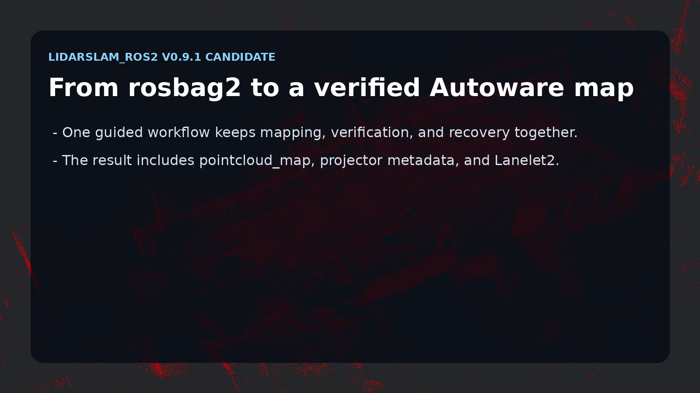
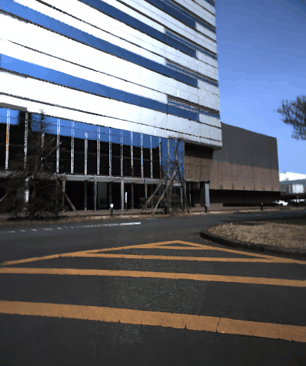

# lidarslam_ros2

[](https://github.com/rsasaki0109/lidarslam_ros2/actions/workflows/main.yml)
[](https://opensource.org/licenses/BSD-2-Clause)
[](#support-and-license)
[](https://github.com/rsasaki0109/lidarslam_ros2/stargazers)

**Turn a rosbag into a map you can actually drive on.**

ROS 2 LiDAR SLAM that outputs an Autoware-ready map bundle — `pointcloud_map/`,
`map_projector_info.yaml`, and auto-generated lanelet2 — and proves it by driving
autonomously on that map in AWSIM. Frontend is `RKO-LIO` (MIT), backend is
`graph_based_slam` (BSD-2). No GPL components on the default workflow.

[](lidarslam/images/social_autoware_map_authoring_demo.mp4)

*Click the card for the demo video. `develop` tracks the current v2 alpha line; latest tagged public beta: [v0.2.2 Release Notes](docs/releases/v0.2.2.md).*

## Why lidarslam_ros2

Most LiDAR SLAM stacks stop at a trajectory and a point cloud. This one ships the
artifacts you need downstream:

- **Autoware-ready output** — `pointcloud_map/` + `map_projector_info.yaml` open
  directly in Autoware map loaders; `verify_autoware_map.py` prints
  `map_verify: PASS` on every saved bundle.
- **lanelet2 auto-generation** — drivable lanelets from the SLAM trajectory,
  validated for multi-segment Autoware routing.
- **Driven, not just plotted** — the map → autonomous-driving loop is dogfooded
  end-to-end in AWSIM ([tutorial](docs/awsim-autonomous-driving-tutorial.md)).
- **Surveyed ground truth** — releases are gated in CI by per-dataset APE
  thresholds, including total-station checkpoints on a Livox MID-360
  ([accuracy](#accuracy)).
- **Loop closure, GPL-free** — built-in Scan Context by default, plus opt-in
  BEV / SOLiD / STD/BTC-style Triangle descriptors and 3D-BBS verification.
- **GNSS georeferencing** — optional GNSS constraints and projector metadata for
  real-world coordinates.

## Quickstart

```bash
cd ~/ros2_ws/src
git clone --recursive https://github.com/rsasaki0109/lidarslam_ros2.git
cd ..
rosdep install --from-paths src --ignore-src -r -y
colcon build --symlink-install --cmake-args -DCMAKE_BUILD_TYPE=Release
source install/setup.bash
```

If you cloned without `--recursive`: `git -C src/lidarslam_ros2 submodule update --init --recursive`.

Then run one public dataset end to end — NTU VIRAL `tnp_01` (~580 s outdoor bag)
through RKO-LIO + graph_based_slam into an Autoware-loadable map:

```bash
cd src/lidarslam_ros2
bash scripts/download_ntu_viral_tnp01.sh
bash scripts/run_autoware_quickstart.sh
python3 scripts/verify_autoware_map.py output/.../pointcloud_map
```

## Use your own bag

```bash
bash scripts/run_autoware_map_beginner.sh /path/to/rosbag2
```

Or invoke the launch files directly:

```bash
ros2 launch lidarslam rko_lio_slam.launch.py \
  bag_path:=/path/to/rosbag2 \
  lidar_topic:=/os_cloud_node/points \
  imu_topic:=/os_cloud_node/imu
ros2 service call /map_save std_srvs/srv/Empty
```

Required topics, optional GNSS / IMU pre-integration, and the dynamic-object
filter parameters are documented in [docs/workflows.md](docs/workflows.md).

## Drive on your map (AWSIM × Autoware)

```bash
bash scripts/test_awsim_setup.sh
bash scripts/run_awsim_selfmade_map_demo.sh
```

Builds the Autoware map bundle from your SLAM output, generates lanelet2 from the
trajectory, and brings up AWSIM + Autoware to drive on it. Multi-terminal bringup
and lanelet2 notes: [docs/awsim-autonomous-driving-tutorial.md](docs/awsim-autonomous-driving-tutorial.md).


## Accuracy

Current numbers from the release-gate profiles (`scripts/release_profiles.yaml`).
Every release is blocked in CI by these per-dataset thresholds.

| Dataset | Sensor | Reference | APE RMSE | Gate (pass) |
| --- | --- | --- | --- | --- |
| NTU VIRAL `tnp_01` (outdoor, ~580 s) | Ouster OS1-16 + VN-100 | Leica prism ground truth | **0.95 m** (best 0.87) | ≤ 1.00 m |
| RTK-SLAM Construction Hall 2 (indoor, ~600 s) | Livox MID-360 | total-station checkpoints¹ | **0.154 m** (median 0.061) | ≤ 0.30 m² |
| RTK-SLAM Construction Hall 1 (indoor, ~741 s) | Livox MID-360 | total-station checkpoints¹ | **0.403 m** (median 0.263) | ≤ 0.55 m² |
| MID-360 indoor loop (~277 s) | Livox MID-360 | cross-validation vs GLIM | 3.64 m | ≤ 4.00 m |
| Newer College `math-hard` (~320 m loop) | Ouster OS0-128 | prism ground truth | reported separately | ≤ 0.10 m |

¹ Surveyed checkpoints from the public RTK-SLAM dataset (CC-BY 4.0); scored on the
dense odometry trajectory, the same form as the dataset's published baselines.
² Report-only until the remaining sequences validate (v0.6); see
[docs/comparison.md](docs/comparison.md) for the full methodology and caveats.

Reproduce locally:

```bash
bash scripts/run_rko_lio_graph_benchmark.sh
bash scripts/run_release_readiness_checks.sh --fail-on-profiles
```

Details and optional MID-360 / production-bundle gates: [docs/benchmarking.md](docs/benchmarking.md).

## Photoreal 3DGS map (optional)

Turn the same SLAM output plus synced camera images into a 3D Gaussian Splatting
scene — LiDAR-primed (no COLMAP), trained with gsplat (Apache-2.0), rendered here
as a flythrough of the reconstructed map:



```bash
bash scripts/run_koide_3dgs_flythrough.sh
```

Pipeline, quality levers, and data-suitability notes: [docs/3dgs-map-tutorial.md](docs/3dgs-map-tutorial.md).

## Docs

- **Getting started**: [Autoware quickstart](docs/autoware-quickstart.md) · [Operator workflows](docs/workflows.md) · [Autoware Foxglove](docs/autoware-foxglove.md)
- **Pipelines**: [AWSIM autonomous-driving tutorial](docs/awsim-autonomous-driving-tutorial.md) · [Autoware-compatible map authoring](docs/autoware-map-authoring.md) · [3DGS map tutorial](docs/3dgs-map-tutorial.md)
- **Benchmarking**: [Benchmarking and release gate](docs/benchmarking.md) · [Comparison](docs/comparison.md)
- **Project**: [v0.2.2 release notes](docs/releases/v0.2.2.md) · [Contributing](CONTRIBUTING.md) · [Changelog](CHANGELOG.md) · [Releasing](RELEASING.md)

Preview the doc site locally: `python3 -m mkdocs serve`.

## Support and license

| ROS 2 distro | Ubuntu | Scope |
| --- | --- | --- |
| Humble | 22.04 | default workflow build + package tests in CI |
| Jazzy  | 24.04 | default workflow build + package tests in CI; Autoware dogfood exercised locally |

`graph_based_slam` is BSD-2-Clause; `RKO-LIO`, `DLIO`, and the optional vendored
`3D-BBS` are MIT; `FAST_GICP` is BSD-3-Clause; built-in Scan Context is implemented
locally. The default workflow excludes GPL-only components — `Thirdparty/lio-sam`
and `Thirdparty/3d_bbs` are gated by `COLCON_IGNORE`.

## Quality gates

```bash
bash scripts/run_default_ci_checks.sh
bash scripts/run_release_readiness_checks.sh --ape-threshold 0.10
```

Reference commands and parameter pointers live in [docs/workflows.md](docs/workflows.md).

---

If this project saves you mapping time, a ⭐ helps others find it.
