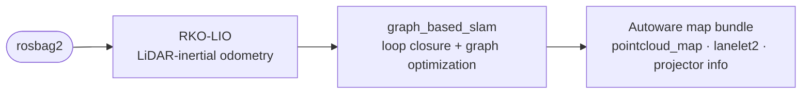
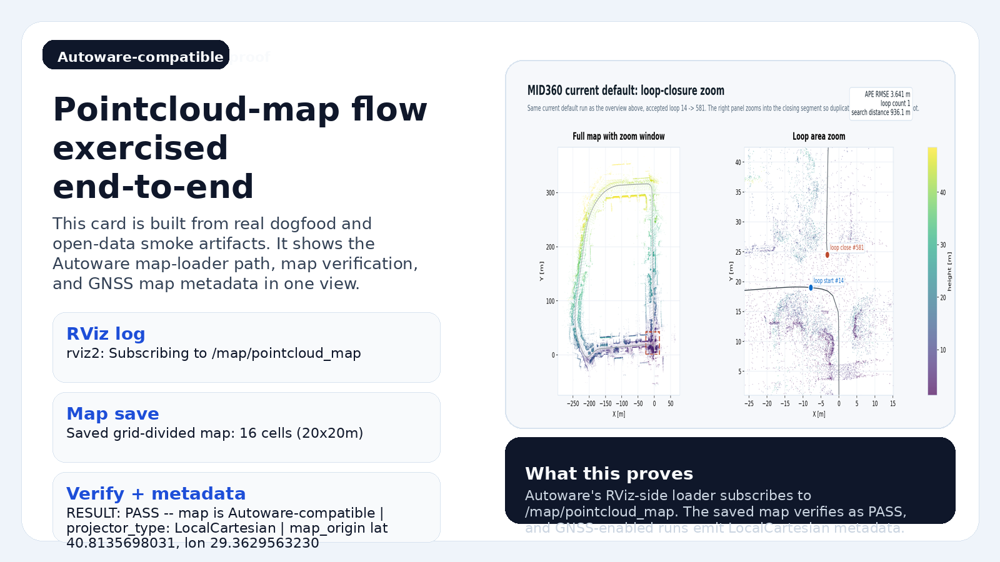

# lidarslam_ros2

[](https://github.com/rsasaki0109/lidar_slam_ros2/actions/workflows/main.yml)
[](https://opensource.org/licenses/BSD-2-Clause)
[](#support-and-license)
[](https://github.com/rsasaki0109/lidar_slam_ros2/stargazers)

**Turn a rosbag into a map you can actually drive on.**

ROS 2 LiDAR SLAM that outputs an Autoware-ready map bundle — `pointcloud_map/`,
`map_projector_info.yaml`, and auto-generated lanelet2. Frontend is `RKO-LIO` (MIT), backend is
`graph_based_slam` (BSD-2). No GPL components on the default workflow.


*Shinjuku point cloud map built from a demo rosbag with this stack — start at the
[Quickstart](#quickstart). `develop` is the default branch; latest release notes:
[v0.6.0](docs/releases/v0.6.0.md).*

## Why lidarslam_ros2

Most LiDAR SLAM stacks stop at a trajectory and a point cloud. This one ships the
artifacts you need downstream:

- **Autoware-ready output** — `pointcloud_map/` + `map_projector_info.yaml` open
  directly in Autoware map loaders; `verify_autoware_map.py` prints
  `map_verify: PASS` on every saved bundle.
- **lanelet2 auto-generation** — drivable lanelets from the SLAM trajectory,
  validated for multi-segment Autoware routing.
- **Surveyed ground truth** — releases are gated in CI by per-dataset APE
  thresholds, including total-station checkpoints on a Livox MID-360
  ([accuracy](#accuracy)).
- **Loop closure, GPL-free** — built-in Scan Context by default, plus opt-in
  BEV / SOLiD / STD/BTC-style Triangle descriptors and 3D-BBS verification.
- **Deterministic offline mapping** — `graph_slam_offline_runner` (backend,
  recorded odometry bag) and `scan_matcher_offline_runner` (frontend, raw bag)
  produce *byte-identical* trajectories, loop edges and submaps on every run
  (verified 3-run on MID-360 and NTU VIRAL); the release gate enforces both
  (`--offline-determinism-bag` / `--frontend-determinism-bag`).
- **Globally refined, quality-gated maps** — clean-room plane bundle adjustment
  refines submap poses offline (default on) under holdout-validated quality
  thresholds; APE and crispness improve together on every GT substrate
  ([evidence](docs/research/map-quality-baseline.md)).
- **GNSS georeferencing** — optional GNSS constraints and projector metadata for
  real-world coordinates.
- **Camera-coloured point-cloud maps** — synchronized images are projected onto
  registered LiDAR scans with calibration-aware, occlusion-resistant colouring.



## Quickstart

Not sure which path fits your setup? Start with the
[Getting Started guide](docs/getting-started.md).

### Try it with Docker (one command, no build)

```bash
docker run --rm -v "$PWD/lidarslam_output:/lidarslam_ws/output" \
  ghcr.io/rsasaki0109/lidar_slam_ros2:humble
```

This pulls the prebuilt image, downloads a public Livox MID-360 driving bag
(517 MB, [Zenodo](https://zenodo.org/records/14841855), CC-BY 4.0) and runs the
full RKO-LIO + graph_based_slam pipeline headless — a few minutes later
`./lidarslam_output/mid360_demo/` holds the Autoware-ready map bundle and
the loop-closed trajectory (`traj_corrected.tum`). Add
`-v lidarslam_demo_data:/lidarslam_ws/datasets` to cache the bag between runs;
appending `bash` instead drops you into an interactive shell.

### Build from source

```bash
cd ~/ros2_ws/src
git clone --recursive https://github.com/rsasaki0109/lidar_slam_ros2.git
cd ..
rosdep install --from-paths src --ignore-src -r -y
colcon build --symlink-install --cmake-args -DCMAKE_BUILD_TYPE=Release
source install/setup.bash
```

If you cloned without `--recursive`: `git -C src/lidar_slam_ros2 submodule update --init --recursive`.

Then run one public dataset end to end — NTU VIRAL `tnp_01` (~580 s outdoor bag)
through RKO-LIO + graph_based_slam into an Autoware-loadable map:

```bash
cd src/lidar_slam_ros2
bash scripts/download_ntu_viral_tnp01.sh
bash scripts/run_autoware_quickstart.sh
python3 scripts/verify_autoware_map.py output/.../pointcloud_map
```

## Use your own bag

```bash
bash scripts/run_autoware_map_beginner.sh /path/to/rosbag2
```

One command turns the bag into a complete Autoware map bundle:
`pointcloud_map/` tiles, `map_projector_info.yaml`, and a `lanelet2_map.osm`
generated from the loop-closed trajectory.

Or invoke the launch files directly:

```bash
ros2 launch lidarslam rko_lio_slam.launch.py \
  bag_path:=/path/to/rosbag2 \
  lidar_topic:=/os_cloud_node/points \
  imu_topic:=/os_cloud_node/imu
ros2 service call /map_save std_srvs/srv/Empty
```

Required topics, optional GNSS / IMU pre-integration, and the dynamic-object
filter parameters are documented in [docs/workflows.md](docs/workflows.md).



## Camera-coloured point-cloud maps

The colouring pipeline uses the corrected SLAM trajectory to register consecutive
LiDAR scans in the map frame, then projects synchronized camera pixels onto the
accumulated geometry. The result below follows the full estimated 60 m walking
loop from RTK-SLAM Construction Hall 1; the trajectory and the coloured map use
the same SLAM poses.


The sequence is from the RTK-SLAM dataset (CC-BY 4.0). Its total-station
checkpoints are also used by the [accuracy gate](#accuracy).

If graph optimization outputs sparse keyframes, the coloured-map pipeline can
propagate their corrections onto the dense SLAM pose stream automatically:

```bash
python3 tools/gaussian_splatting/colored_map_pipeline.py \
  <bag> output/<run>/traj_corrected.tum output/<run>/colored_map \
  --raw-traj output/<run>/traj_raw.tum \
  --extrinsic configs/gaussian_splatting/<lidar_camera_extrinsic>.yaml
```

The generated `dense_corrected_trajectory.tum` is reused on later runs. Use
`--force-trajectory` to regenerate it explicitly. The pipeline also detects
newer trajectory and posed-image inputs and automatically rebuilds downstream
artifacts, preventing stale coloured maps from being silently reused.

When a `PointCloud2` scan carries per-point `timestamp`, `time`, or `t`, map
accumulation deskews the scan against the dense trajectory in 1 ms pose bins.
Use `--no-deskew` on `build_lidar_init.py` only for an explicit A/B baseline.
On HILTI 2022 exp04 this reduced mean plane thickness from 8.89 cm to 6.25 cm
and increased planar coverage from 21.38% to 48.16%.

## Accuracy

Current numbers from the release-gate profiles (`scripts/release_profiles.yaml`).
Every release is blocked in CI by these per-dataset thresholds.

| Dataset | Sensor | Reference | APE RMSE | Gate (pass) |
| --- | --- | --- | --- | --- |
| NTU VIRAL `tnp_01` (outdoor, ~580 s) | Ouster OS1-16 + VN-100 | Leica prism ground truth | **0.95 m** (best 0.87) | ≤ 1.00 m |
| RTK-SLAM Construction Hall 2 (indoor, ~600 s) | Livox MID-360 | total-station checkpoints¹ | **0.154 m** (median 0.061) | ≤ 0.30 m |
| RTK-SLAM Construction Hall 1 (indoor, ~741 s) | Livox MID-360 | total-station checkpoints¹ | **0.403 m** (median 0.263) | ≤ 0.55 m |
| RTK-SLAM Stadtgarten 2 (outdoor park, ~876 s) | Livox MID-360 | total-station checkpoints¹ | **0.835 m** (median 0.327) | report-only² |
| RTK-SLAM Stadtgarten 1 (outdoor park, ~1 km loop) | Livox MID-360 | total-station checkpoints¹ | **1.666 m** (median 1.511) | report-only² |
| Newer College `math-hard` (~320 m loop) | Ouster OS0-128 | prism ground truth | reported separately | ≤ 0.10 m |

¹ Surveyed checkpoints from the public RTK-SLAM dataset (CC-BY 4.0), scored like
its published baselines (dense odometry trajectory).
² Outdoor profiles soak as report-only before graduating; the former GLIM
cross-validation gate is also report-only since v0.5. Methodology and
caveats: [docs/comparison.md](docs/comparison.md).

Reproduce locally:
```bash
bash scripts/run_rko_lio_graph_benchmark.sh
bash scripts/run_release_readiness_checks.sh --fail-on-profiles
```

Details and optional MID-360 / production-bundle gates: [docs/benchmarking.md](docs/benchmarking.md).

## Docs

- **Getting started**: [Getting Started](docs/getting-started.md) · [Autoware quickstart](docs/autoware-quickstart.md) · [Operator workflows](docs/workflows.md) · [Autoware Foxglove](docs/autoware-foxglove.md)
- **Pipelines**: [Autoware-compatible map authoring](docs/autoware-map-authoring.md)
- **Benchmarking**: [Benchmarking and release gate](docs/benchmarking.md) · [Comparison](docs/comparison.md)
- **Project**: [v0.2.2 release notes](docs/releases/v0.2.2.md) · [Contributing](CONTRIBUTING.md) · [Changelog](CHANGELOG.md) · [Releasing](RELEASING.md)

Preview the doc site locally: `python3 -m mkdocs serve`.

## Support and license

| ROS 2 distro | Ubuntu | Scope |
| --- | --- | --- |
| Humble | 22.04 | default workflow build + package tests in CI |
| Jazzy  | 24.04 | default workflow build + package tests in CI; Autoware dogfood exercised locally |

`graph_based_slam` is BSD-2-Clause; `RKO-LIO`, `DLIO`, and the optional vendored
`3D-BBS` are MIT; `FAST_GICP` is BSD-3-Clause; built-in Scan Context is local. GPL-only
components (`Thirdparty/lio-sam`, `Thirdparty/3d_bbs`) are excluded via `COLCON_IGNORE`.

## Quality gates

```bash
bash scripts/run_default_ci_checks.sh
bash scripts/run_release_readiness_checks.sh --ape-threshold 0.10
```

Reference commands and parameter pointers live in [docs/workflows.md](docs/workflows.md).

---

If this project saves you mapping time, a ⭐ helps others find it.
