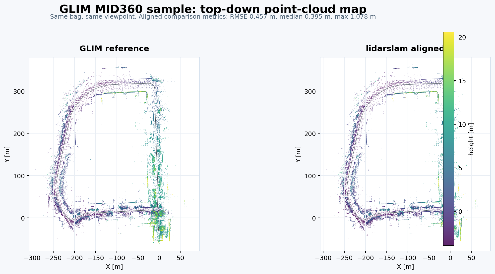
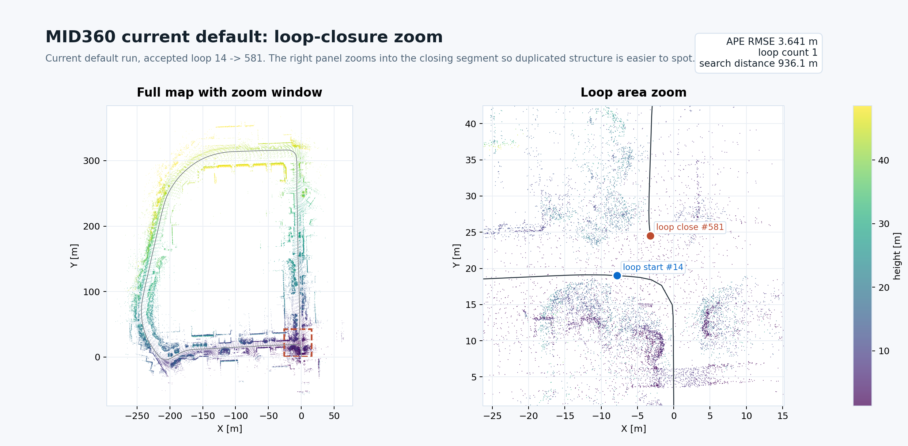

lidarslam_ros2
====

ROS 2 LiDAR SLAM focused on permissive-license pointcloud-map generation and
Autoware integration.

> Status: `develop` tracks the current `v2 alpha` line.
> For the latest tagged public beta, see
> [v0.2.0 Release Notes](docs/releases/v0.2.0.md).

## Recommended Public Workflow

The recommended public path in this repository is:

- frontend: `RKO-LIO`
- backend: `graph_based_slam`
- output: Autoware-compatible `pointcloud_map/` and `map_projector_info.yaml`

This is the path exercised in the public quickstart, benchmark flow, and
release/readiness gate.

## Scope

This repository is for people who want:

- ROS 2 LiDAR SLAM with loop closure
- pointcloud maps that Autoware can load
- a permissive-license default workflow

Out of scope for the public path:

- `lanelet2_map.osm` generation
- Autoware planning/localization bringup
- GPL-only frontends in the default workflow

## Why This Repo

- permissive default path: `graph_based_slam` (BSD-2-Clause), `scanmatcher`
  (project-local), `RKO-LIO` (MIT), `DLIO` (MIT), `FAST_GICP` (BSD-3-Clause)
- Autoware pointcloud-map flow is exercised end-to-end
- default benchmark path is tracked on `NTU VIRAL`
- current long-loop evidence is tracked on `MID360`
- optional GNSS georeferencing writes `map_projector_info.yaml`
- GNSS edges can use covariance-based weighting, with RTK-like fixes inferred
  from low horizontal covariance
- GPL-free Scan Context place recognition is available in
  `graph_based_slam`

## Install

Clone with submodules and install dependencies:

```bash
cd ~/ros2_ws/src
git clone --recursive https://github.com/rsasaki0109/lidarslam_ros2.git
cd ..
rosdep install --from-paths src --ignore-src -r -y
```

If you already cloned without submodules:

```bash
git -C src/lidarslam_ros2 submodule update --init --recursive
```

Build the workspace:

```bash
colcon build --symlink-install --cmake-args -DCMAKE_BUILD_TYPE=Release
```

## Quickstart

Run the default local checks:

```bash
bash scripts/run_default_ci_checks.sh
```

Run the fixed public Autoware pointcloud-map quickstart:

```bash
bash scripts/download_ntu_viral_tnp01.sh
bash scripts/run_autoware_quickstart.sh
```

## Point-Cloud Map Example

Representative top-down point-cloud map view from the MID360 sample. Colors
encode height.



Loop-area zoom from the current MID360 default run. This view is meant to make
closing-segment duplication easier to judge visually.



## Docs

- [Autoware Quickstart](docs/autoware-quickstart.md)
- [Operator Workflows](docs/workflows.md)
- [Benchmarking And Release Gate](docs/benchmarking.md)
- [Comparison](docs/comparison.md)
- [v0.2.0 Release Notes](docs/releases/v0.2.0.md)
- [Contributing](CONTRIBUTING.md)
- [Changelog](CHANGELOG.md)
- [Releasing](RELEASING.md)

## Current Snapshot

| Dataset | Published configuration | Reference kind | APE RMSE (m) | Autoware map verify |
| --- | --- | --- | --- | --- |
| `NTU VIRAL tnp_01` | current default | `ground_truth` | `0.952` | `PASS` |
| `NTU VIRAL tnp_01` | best observed | `ground_truth` | `0.870` | `PASS` |
| `MID360` | current default | `cross_validation` | `3.641` | `PASS` |
| `MID360` | best observed | `cross_validation` | `3.590` | `PASS` |

More detail lives in [docs/comparison.md](docs/comparison.md),
[docs/benchmarking.md](docs/benchmarking.md), `output/benchmark_summary.md`,
and `output/latest_report.html`.

## Main Entrypoints

Required input topics for the main public path:

| Launch path | Required topics | Optional topics |
| --- | --- | --- |
| `ros2 launch lidarslam rko_lio_slam.launch.py` | LiDAR `sensor_msgs/PointCloud2` on `lidar_topic`, IMU `sensor_msgs/Imu` on `imu_topic` | `sensor_msgs/NavSatFix` on `gnss_topic` (default: `/gnss/fix`) when `use_gnss:=true` |
| `ros2 launch lidarslam lidarslam.launch.py` | Point cloud `sensor_msgs/PointCloud2` on `input_cloud`, TF from `robot_frame_id` to the LiDAR frame | IMU on `imu_topic` when `scanmatcher use_imu:=true`, odom TF when `scanmatcher use_odom:=true`, GNSS on `gnss_topic` (default: `/gnss/fix`) when backend `use_gnss:=true` |
| `ros2 launch graph_based_slam graphbasedslam.launch.py` | `lidarslam_msgs/MapArray` on `map_array` | IMU on `/imu` when `use_imu_preintegration:=true`, GNSS on `gnss_topic` (default: `/gnss/fix`) when `use_gnss:=true` |

There is no wheel-speed / vehicle-speed input in the current public path yet.
Inspect GNSS covariance quality before enabling backend GNSS weighting:

```bash
python3 scripts/inspect_navsatfix_covariance.py /path/to/rosbag2 --topic /gnss/fix
```
The backend GNSS subscription topic is configurable with `gnss_topic` (default: `/gnss/fix`).
`scripts/run_open_data_gnss_smoke.sh` auto-detects the NavSatFix topic if you do not pass `--gnss-topic`.

Some open-data bags expose GNSS quality only through Applanix raw messages. For those, inspect `GSOF50` first:

```bash
git clone --depth=1 https://github.com/autowarefoundation/applanix.git /tmp/applanix
python3 scripts/inspect_applanix_gsof50_quality.py /path/to/rosbag2 \
  --topic /lvx_client/gsof/ins_solution_rms_50 \
  --applanix-msg-dir /tmp/applanix/applanix_msgs/msg
```

To use those bags with the current public `NavSatFix` path, generate a small sidecar rosbag2 with `scripts/convert_applanix_gsof_to_navsatfix_bag.py`. The
full command is in [docs/workflows.md](docs/workflows.md).

Run the public Autoware quickstart:

```bash
bash scripts/run_autoware_quickstart.sh
```

Run `RKO-LIO + graph_based_slam` directly:

```bash
ros2 launch lidarslam rko_lio_slam.launch.py \
  bag_path:=/path/to/rosbag2 \
  lidar_topic:=/os_cloud_node/points \
  imu_topic:=/os_cloud_node/imu
```

Save the current map:

```bash
ros2 service call /map_save std_srvs/srv/Empty
```

Run the standard benchmark path:

```bash
bash scripts/download_ntu_viral_tnp01.sh
bash scripts/run_rko_lio_graph_benchmark.sh
```

Run the local readiness gate:

```bash
bash scripts/run_release_readiness_checks.sh --ape-threshold 0.10
```

## License Policy

The default public workflow is restricted to permissive-license components.

- `graph_based_slam`: BSD-2-Clause
- `scanmatcher`: project-local frontend/backend code in this repository
- `RKO-LIO`: MIT
- `DLIO`: MIT
- `FAST_GICP`: BSD-3-Clause
- built-in `Scan Context`: implemented locally to avoid GPL dependencies

`Thirdparty/lio-sam` is excluded from default `colcon` package discovery via
`COLCON_IGNORE`.

## Support Matrix

| ROS 2 distro | Ubuntu | Scope |
| --- | --- | --- |
| Humble | 22.04 | default workflow build and package tests in CI |
| Jazzy | 24.04 | default workflow build and package tests in CI; Autoware pointcloud-map dogfood exercised locally |

## Quality Gates

The main checks for the public path are:

- `bash scripts/run_default_ci_checks.sh`
- `python3 scripts/verify_autoware_map.py <pointcloud_map_dir>`
- `bash scripts/run_autoware_quickstart.sh`
- `bash scripts/run_rko_lio_graph_autoware_dogfood.sh --auto-exit-secs 20`
- `bash scripts/run_release_readiness_checks.sh --ape-threshold 0.10`

For the command-level details, parameter-file pointers, and Autoware map output
notes, see [docs/workflows.md](docs/workflows.md).
