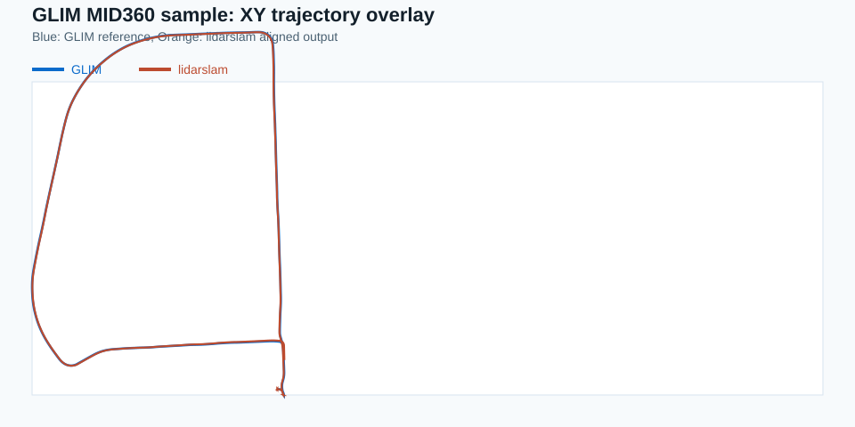
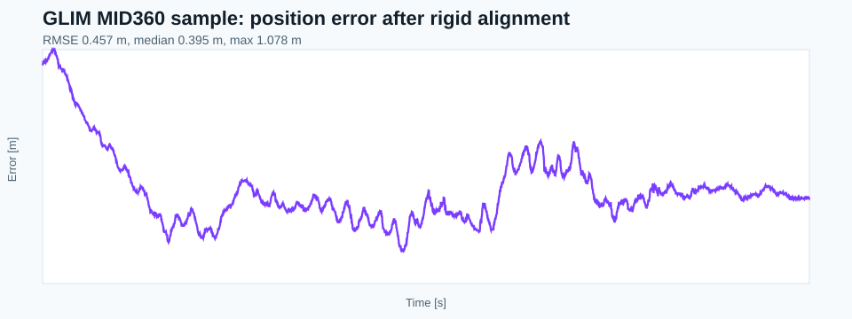
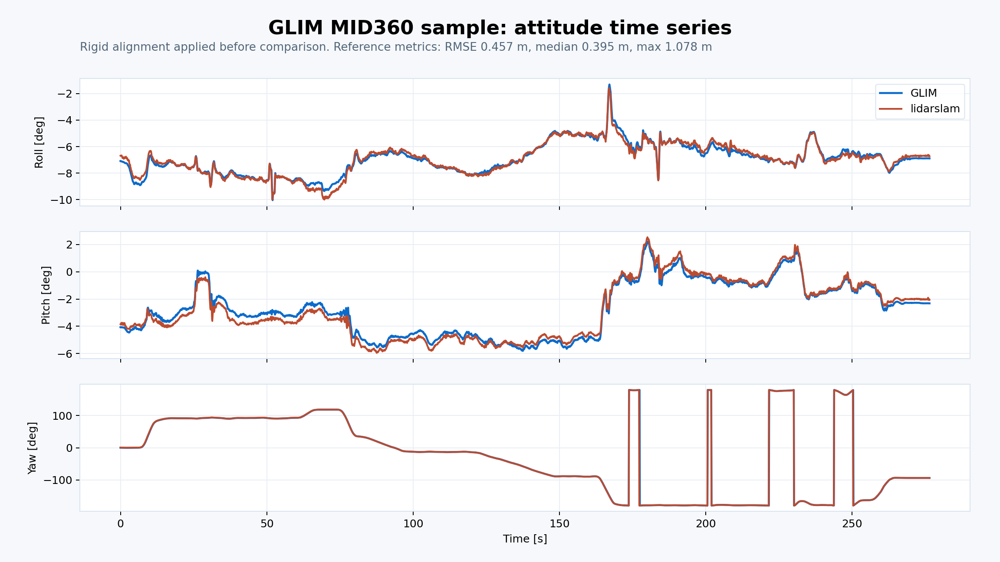

lidarslam_ros2
====
ROS 2 SLAM package with a scan-matching frontend and a graph-based SLAM backend with loop closure.

## Features

- **Multiple registration methods**: NDT, GICP, FAST_GICP, SMALL_GICP
- **LIO frontend support**: RKO-LIO and DLIO odometry can feed into graph_based_slam for loop closure
- **GPL-free Scan Context loop detection**: built-in Scan Context descriptor for place recognition without GPL dependencies
- **Stronger loop validation**: evaluates multiple loop candidates, rejects excessive correction jumps, and keeps only the best local loop edge
- **PCD disk cache**: memory-efficient submap storage that pages point clouds to disk
- **Adaptive correspondence threshold**: automatically adjusts the registration correspondence distance based on an exponential moving average of fitness scores
- **GNSS constraints**: optional NavSatFix integration for georeferenced mapping with pose graph optimization
- **Autoware-compatible map output**: grid-divided PCD maps with metadata for `pointcloud_map_loader`, plus `map_projector_info.yaml` for georeferencing

## License Policy

The default workflow in this repository is restricted to permissive-license components:

- `graph_based_slam`: BSD-2-Clause
- `scanmatcher`: project-local frontend/backend code in this repository
- `RKO-LIO`: MIT
- `DLIO`: MIT
- `FAST_GICP`: BSD-3-Clause
- built-in `Scan Context`: implemented locally to avoid GPL dependencies

The recommended and dogfooded path is `RKO-LIO + graph_based_slam`. Optional third-party research frontends are not part of the default workflow. In particular, `Thirdparty/lio-sam` is excluded from default `colcon` package discovery via `COLCON_IGNORE`.

## Recommended Quickstart

If you want the shortest supported path today, use the default permissive workflow:

```bash
colcon build --symlink-install --cmake-args -DCMAKE_BUILD_TYPE=Release
bash scripts/run_default_ci_checks.sh
```

To dogfood the full pointcloud-map path into Autoware's map loaders:

```bash
bash scripts/download_ntu_viral_tnp01.sh
bash scripts/run_autoware_quickstart.sh
```

If you are coming from Autoware first, start here:

- [Autoware Quickstart](docs/autoware-quickstart.md)
- [Comparison](docs/comparison.md)
- [Benchmarking And Release Gate](docs/benchmarking.md)
- [v0.2.0 Release Notes](docs/releases/v0.2.0.md)
- [Contributing](CONTRIBUTING.md)
- [Changelog](CHANGELOG.md)
- [Releasing](RELEASING.md)

## Support Matrix

| ROS 2 distro | Ubuntu | Scope |
|---|---|---|
| Humble | 22.04 | Default workflow build + package tests in CI |
| Jazzy | 24.04 | Default workflow build + package tests in CI; Autoware pointcloud-map dogfood exercised locally |

## Quality Gates

These are the health checks for the default workflow:

- `bash scripts/run_default_ci_checks.sh`
- `python3 scripts/verify_autoware_map.py <pointcloud_map_dir>`
- `bash scripts/run_autoware_quickstart.sh`
- `bash scripts/run_rko_lio_graph_autoware_dogfood.sh --auto-exit-secs 20`

To run the local release/readiness gate in one shot:

```bash
bash scripts/run_release_readiness_checks.sh --ape-threshold 0.10
```

That wrapper runs the default build/test checks, summarizes any existing benchmark `metrics.json` files under `output/`, and can optionally run the Autoware dogfood flow with `--dogfood`.
When benchmark metrics are present it also writes a static HTML report under the readiness output directory, and with `--ape-threshold` it exits non-zero if any selected run is missing APE or exceeds the threshold. By default that hard gate is scoped to `ground_truth` runs, so `cross_validation` artifacts such as MID360 can appear in reports without blocking release.
CI also runs the readiness gate against synthetic benchmark fixtures, including a failing profile that must trip the threshold gate, so summary/report generation and threshold enforcement stay exercised even without large datasets.
For a narrower explanation of the benchmark and release flow, see [docs/benchmarking.md](docs/benchmarking.md).

## Benchmark Results

Newer College math-hard dataset (APE RMSE, meters):

| Method | RMSE |
|---|---|
| RKO-LIO + graph_based_slam loop closure (info=1000) | **0.078 m** |
| RKO-LIO raw | 0.082 m |
| KISS-ICP | 0.440 m |
| lidarslam NDT baseline | 24.286 m |

To summarize collected benchmark runs into Markdown/CSV:

```bash
python3 scripts/benchmark_summary.py \
  --root output \
  --write-md output/benchmark_summary.md \
  --write-csv output/benchmark_summary.csv
```

To generate the static HTML benchmark report from the same metrics:

```bash
python3 scripts/generate_html_report.py \
  --root output \
  --out output/latest_report.html
```

To generate a concise public-beta readiness snapshot from the current local
benchmark and dogfood artifacts:

```bash
python3 scripts/generate_v2_beta_readiness_report.py
```

To generate a separate stress-validation snapshot that distinguishes current
default-path evidence from older long-loop and hard-dataset artifacts:

```bash
python3 scripts/generate_stress_validation_report.py
```

For the public comparison page and release-note snapshot built from these same
artifacts, see [docs/comparison.md](docs/comparison.md) and
[docs/releases/v0.2.0.md](docs/releases/v0.2.0.md).

To run the recommended benchmark path on the NTU VIRAL bag and emit
`metrics.json` for the report pipeline:

```bash
bash scripts/download_ntu_viral_tnp01.sh
bash scripts/run_rko_lio_graph_benchmark.sh
```

That wrapper regenerates `output/ntu_viral_tnp01_gt_leica.tum` if needed, runs
`RKO-LIO + graph_based_slam`, saves `traj_raw_prism.tum` /
`traj_corrected_prism.tum`, computes APE against the Leica reference, verifies
the Autoware map bundle when available, and writes `metrics.json` under the run
directory.

To promote an already-recorded aligned run such as the MID360 long-loop check
into the same reporting pipeline:

```bash
python3 scripts/write_aligned_trajectory_metrics.py \
  --out-dir output/bench_rko_lio_mid360_v3 \
  --bag demo_data/glim_mid360/rosbag2_2024_04_16-14_17_01 \
  --reference-tum output/glim_mid360_reference.tum \
  --corrected-tum output/bench_rko_lio_mid360_v3/traj_corrected.tum \
  --raw-tum output/bench_rko_lio_mid360_v3/traj_raw.tum \
  --graph-log output/bench_rko_lio_mid360_v3/graph_slam.log \
  --reference-source glim_mid360_reference \
  --reference-kind cross_validation \
  --reference-label GLIM \
  --points-topic /livox/lidar \
  --points-frame livox_frame \
  --robot-frame livox_frame
```

To rerun the current `RKO-LIO + graph_based_slam` MID360 cross-validation path
from scratch:

```bash
bash scripts/run_rko_lio_mid360_crossval_benchmark.sh
```

The MID360 wrapper now defaults to a tuned frontend/backend profile
(`voxel_size=0.5`, `max_range=80.0`, `search_submap_num=5`,
`loop_edge_dedup_index_window=20`, `loop_edge_info_weight=200`).
To also test IMU initialization:

```bash
bash scripts/run_rko_lio_mid360_crossval_benchmark.sh --initialization-phase true
```

For repeated APE-first sweeps against GLIM:

```bash
bash scripts/run_ape_cycle.sh --cycles 5 -- \
  --official --variant livox --download \
  --glim-mode lidar-only --auto-static-tf
```

## RKO-LIO Frontend with Loop Closure

RKO-LIO can be used as a LIO frontend, with `graph_based_slam` providing loop closure on its odometry output.

```bash
ros2 launch lidarslam rko_lio_slam.launch.py \
  bag_path:=/path/to/rosbag2 \
  lidar_topic:=/os_cloud_node/points \
  imu_topic:=/os_cloud_node/imu
```

Key `graph_based_slam` parameters for this workflow:

| Name | Type | Default | Description |
|---|---|---|---|
| adjacent_edge_info_weight | double | 1000.0 | Information weight for adjacent edges in the pose graph. Higher values trust the LIO odometry more. |
| loop_edge_info_weight | double | 100.0 | Base information weight for accepted loop-closure edges before fitness-based scaling |
| loop_edge_robust_kernel_delta | double | 1.0 | Huber kernel delta applied to loop-closure edges to reduce outlier impact |
| threshold_loop_closure_score | double | 1.0 | NDT fitness score threshold for accepting a loop closure |
| max_loop_candidate_count | int | 3 | Number of geometric loop candidates to evaluate per loop-search cycle |
| loop_edge_dedup_index_window | int | 8 | Keep only the best loop edge inside this index-space neighborhood on both endpoints |
| loop_max_translation_delta | double | 15.0 | Reject loop candidates whose registration correction translates the latest submap more than this many meters |
| loop_max_rotation_delta_deg | double | 45.0 | Reject loop candidates whose registration correction rotates the latest submap more than this many degrees |
| use_scan_context | bool | false | Enable Scan Context descriptors for loop detection (GPL-free) |
| use_pcd_cache | bool | false | Cache submaps to PCD files on disk to reduce memory usage |

## Creating Maps for Autoware

Autoware-first walkthrough: [docs/autoware-quickstart.md](docs/autoware-quickstart.md)

lidarslam_ros2 can generate point cloud maps compatible with Autoware's `pointcloud_map_loader`.

When map saving is triggered (via loop closure or `ros2 service call /map_save std_srvs/Empty`), the map is automatically divided into grid cells and saved with metadata.

Output structure:
```
pointcloud_map/
  pointcloud_map_metadata.yaml   # Grid cell metadata for Autoware
  0_0.pcd                        # Grid cell PCD files (binary compressed)
  0_20.pcd
  20_0.pcd
  ...
map.pcd                          # Full map (single file, for visualization)
```

Key parameters for map output:

| Name | Type | Default | Description |
|---|---|---|---|
| map_save_dir | string | "." | Output directory for map files |
| map_grid_size_x | double | 20.0 | Grid cell width [m] |
| map_grid_size_y | double | 20.0 | Grid cell height [m] |
| map_leaf_size | double | 0.2 | Voxel downsampling resolution [m] |
| gnss_origin_min_samples | int | 3 | Number of consistent GNSS fixes required before locking the map origin |
| gnss_origin_consistency_threshold_m | double | 20.0 | Maximum spread between startup GNSS fixes used to initialize the map origin [m] |

`map_projector_info.yaml` is always generated for Autoware. Without GNSS it is written as `projector_type: Local`; with GNSS it is written as `projector_type: LocalCartesian` plus `map_origin`.
When `use_gnss:=true`, GNSS position constraints are added to the pose graph and the map origin is initialized only after `gnss_origin_min_samples` mutually consistent fixes, which avoids locking the origin to startup junk values.

To use the map in Autoware, copy the `pointcloud_map/` directory and `map_projector_info.yaml` to your Autoware map directory.

To stage a `graph_based_slam` output directory directly into an Autoware map bundle and verify it:

```bash
bash scripts/prepare_autoware_map_from_graph_slam.sh \
  output/bench_rko_lio_ntu_viral_loopgate_20260324 \
  /tmp/autoware_maps/ntu_viral_loopgate
```

To run the Autoware Docker smoke test immediately after staging:

```bash
bash scripts/prepare_autoware_map_from_graph_slam.sh \
  output/bench_rko_lio_ntu_viral_loopgate_20260324 \
  /tmp/autoware_maps/ntu_viral_loopgate \
  --smoke \
  --autoware-core-dir /tmp/autoware_core \
  --work-dir /tmp/autoware_map_runtime_ws
```

To open the staged pointcloud map in the host `rviz2` using Autoware's map loaders in Docker:

```bash
bash scripts/run_autoware_pointcloud_map_viewer_docker.sh \
  /tmp/autoware_maps/ntu_viral_loopgate \
  /tmp/autoware_core \
  /tmp/autoware_map_runtime_ws
```

The first viewer launch automatically builds a local runtime image named `lidarslam_autoware_map_runtime:jazzy`, then starts `autoware_map_projection_loader` and `autoware_pointcloud_map_loader` in Docker and opens a pointcloud-only RViz config on the host. The script forces Fast DDS to `UDPv4` so the host RViz can receive `/map/pointcloud_map` reliably from the container.
The viewer wrapper expects host-side `docker`, `ros2`, `rviz2`, and a working X11 `DISPLAY`. It is interactive and keeps running until the RViz window is closed; for unattended checks, pass `--auto-exit-secs <sec>`.

To go directly from a `graph_based_slam` output directory to the Autoware RViz viewer through the fixed public entrypoint:

```bash
bash scripts/run_autoware_quickstart.sh \
  output/bench_rko_lio_ntu_viral_loopgate_20260324
```

By default this stages the bundle under `/tmp/autoware_maps/<output_dir_name>` and then launches the same Dockerized viewer flow. The underlying helper remains `scripts/run_graph_slam_pointcloud_map_in_autoware.sh`.

To dogfood the full pointcloud-map path end-to-end on the NTU VIRAL rosbag2:

```bash
bash scripts/download_ntu_viral_tnp01.sh
bash scripts/run_autoware_quickstart.sh
```

`download_ntu_viral_tnp01.sh` downloads the official `tnp_01` sequence, converts it to `rosbag2`, and writes the restamped `tnp_01_points_restamped_vn100_rosbag2` input expected by the dogfood wrapper. The quickstart entrypoint then runs `RKO-LIO + graph_based_slam` on `demo_data/ntu_viral/tnp_01_points_restamped_vn100_rosbag2`, calls `/map_save`, verifies the saved Autoware map bundle, and opens it in the host `rviz2`. The NTU VIRAL extrinsics used for this flow live in [lidarslam/param/rko_lio_ntu_viral.yaml](ros2/lidarslam/param/rko_lio_ntu_viral.yaml).
By default it proceeds once the first usable Autoware map bundle is saved; add `--wait-for-offline-completion` if you want to wait for the full bag to finish before saving and viewing.
This dogfood path has been exercised end-to-end as `rosbag2 -> RKO-LIO + graph_based_slam -> /map_save -> Autoware map bundle verify -> Docker map loaders -> host rviz2`.

Default dogfood input:

- ROS 2 `rosbag2` directory: `demo_data/ntu_viral/tnp_01_points_restamped_vn100_rosbag2`
- LiDAR topic: `/os1_cloud_node1/points`
- IMU topic: `/imu/imu`
- RKO-LIO parameters: [lidarslam/param/rko_lio_ntu_viral.yaml](ros2/lidarslam/param/rko_lio_ntu_viral.yaml)
- Output directory: `output/dogfood_rko_lio_autoware_<timestamp>/`

For a full-bag unattended dogfood run that closes RViz automatically after 20 seconds:

```bash
bash scripts/run_autoware_quickstart.sh dogfood \
  --wait-for-offline-completion \
  --auto-exit-secs 20
```

If you already built the minimal Autoware map-loader runtime once, reuse it to skip the rebuild/smoke stage:

```bash
bash scripts/run_autoware_quickstart.sh dogfood \
  --viewer-run-dir /tmp/autoware_map_runtime_ws/run.<id> \
  --auto-exit-secs 20
```

## requirement to build
You need  [ndt_omp_ros2](https://github.com/rsasaki0109/ndt_omp_ros2) for scan-matcher

clone
(If you forget to add the --recursive option when you do a git clone, run `git submodule update --init --recursive` in the lidarslam_ros2 directory)
```
cd ~/ros2_ws/src
git clone --recursive https://github.com/rsasaki0109/lidarslam_ros2
cd ..
rosdep install --from-paths src --ignore-src -r -y
```
build
```
colcon build --symlink-install --cmake-args -DCMAKE_BUILD_TYPE=Release
bash scripts/run_default_ci_checks.sh
```

## io

### frontend(scan-matcher) 
- input  
/input_cloud  (sensor_msgs/PointCloud2)  
/tf(from "base_link" to LiDAR's frame)  
/initial_pose  (geometry_msgs/PoseStamed)(optional)  
/imu  (sensor_msgs/Imu)(optional)  
/tf(from "odom" to "base_link")(Odometry)(optional)  

- output  
/current_pose (geometry_msgs/PoseStamped)  
/map  (sensor_msgs/PointCloud2)  
/path  (nav_msgs/Path)  
/tf(from "map" to "base_link")  
/map_array(lidarslam_msgs/MapArray)

### backend(graph-based-slam)
- input  
/map_array(lidarslam_msgs/MapArray)
- output  
/modified_path  (nav_msgs/Path)   
/modified_map  (sensor_msgs/PointCloud2)  

- srv  
/map_save  (std_srvs/Empty)　　

## how to save the map

`pose_graph.g2o` and `map.pcd` are saved in loop closing or using the following service call.

```
ros2 service call /map_save std_srvs/Empty
```

## params

- frontend(scan-matcher) 

|Name|Type|Default value|Description|
|---|---|---|---|
|registration_method|string|"NDT"|"NDT", "GICP", "FAST_GICP", or "SMALL_GICP"|
|ndt_resolution|double|5.0|resolution size of voxel[m]|
|ndt_num_threads|int|0|threads using ndt(if `0` is set, maximum alloawble threads are used.)(The higher the number, the better, but reduce it if the CPU processing is too large to estimate its own position.)|
|gicp_corr_dist_threshold|double|5.0|the distance threshold between the two corresponding points of the source and target[m]|
|adaptive_correspondence_threshold|bool|false|automatically adjust correspondence distance using an EMA of fitness scores|
|trans_for_mapupdate|double|1.5|moving distance of map update[m]|
|vg_size_for_input|double|0.2|down sample size of input cloud[m]|
|vg_size_for_map|double|0.05|down sample size of map cloud[m]|
|use_min_max_filter|bool|false|whether or not to use minmax filter|
|scan_max_range|double|100.0|max range of input cloud[m]|
|scan_min_range|double|1.0|min range of input cloud[m]|
|scan_period|double|0.1|scan period of input cloud[sec](If you want to compound imu, you need to change this parameter.)|
|map_publish_period|double|15.0|period of map publish[sec]|
|num_targeted_cloud|int|10|number of targeted cloud in registration(The higher this number,  the less distortion.)|
|set_initial_pose|bool|false|whether or not to set the default pose value in the param file|
|initial_pose_x|double|0.0|x-coordinate of the initial pose value[m]|
|initial_pose_y|double|0.0|y-coordinate of the initial pose value[m]|
|initial_pose_z|double|0.0|z-coordinate of the initial pose value[m]|
|initial_pose_qx|double|0.0|Quaternion x of the initial pose value|
|initial_pose_qy|double|0.0|Quaternion y of the initial pose value|
|initial_pose_qz|double|0.0|Quaternion z of the initial pose value|
|initial_pose_qw|double|1.0|Quaternion w of the initial pose value|
|publish_tf|bool|true|Whether or not to publish tf from global frame to robot frame|
|use_odom|bool|false|whether odom is used or not for initial attitude in point cloud registration|
|use_imu|bool|false|whether 9-axis imu(Angular velocity, acceleration and orientation must be included.) is used or not for point cloud distortion correction.(Note that you must also set the `scan_period`.)|
|debug_flag|bool|false|Whether or not to display the registration information|


- backend(graph-based-slam)

|Name|Type|Default value|Description|
|---|---|---|---|
|registration_method|string|"NDT"|"NDT", "GICP", "FAST_GICP", or "SMALL_GICP"|
|ndt_resolution|double|5.0|resolution size of voxel[m]|
|ndt_num_threads|int|0|threads using ndt(if `0` is set, maximum alloawble threads are used.)|
|voxel_leaf_size|double|0.2|down sample size of input cloud[m]|
|loop_detection_period|int|1000|period of searching loop detection[ms]|
|threshold_loop_closure_score|double|1.0| fitness score of ndt for loop closure|
|distance_loop_closure|double|20.0| distance far from revisit candidates for loop closure[m]|
|range_of_searching_loop_closure|double|20.0|search radius for candidate points from the present for loop closure[m]|
|search_submap_num|int|2|the number of submap points before and after the revisit point used for registration|
|max_loop_candidate_count|int|3|maximum number of nearby loop candidates to validate geometrically per cycle|
|loop_edge_dedup_index_window|int|8|keep only the best loop edge when both endpoints fall within this index-space neighborhood|
|loop_max_translation_delta|double|15.0|reject loop candidates whose registration correction translates the latest submap more than this value [m]|
|loop_max_rotation_delta_deg|double|45.0|reject loop candidates whose registration correction rotates the latest submap more than this value [deg]|
|num_adjacent_pose_cnstraints|int|5|connect each node to up to this many immediately preceding nodes, keeping the odometry chain anchored|
|adjacent_edge_info_weight|double|1000.0|base information matrix weight for adjacent edges (farther neighbors are down-weighted by index separation)|
|loop_edge_info_weight|double|100.0|base information matrix weight for loop edges before scaling by registration fitness|
|loop_edge_robust_kernel_delta|double|1.0|Huber kernel delta applied to loop edges to reduce the impact of bad closures|
|use_scan_context|bool|false|enable Scan Context loop detection (GPL-free)|
|use_pcd_cache|bool|false|cache submaps to PCD files on disk to reduce memory|
|use_save_map_in_loop|bool|true|Whether to save the map when loop close(If the map saving process in loop close is too heavy and the self-position estimation fails, set this to `false`.)|
|map_save_dir|string|"."|output directory for map files|
|map_grid_size_x|double|20.0|grid cell width for Autoware-compatible map division [m]|
|map_grid_size_y|double|20.0|grid cell height for Autoware-compatible map division [m]|
|map_leaf_size|double|0.2|voxel downsampling resolution for saved map [m]|
|use_gnss|bool|false|enable GNSS position constraints in pose graph (subscribes to /gnss/fix)|
|gnss_info_weight|double|1.0|information weight for GNSS position constraints|
|gnss_origin_min_samples|int|3|number of consistent GNSS fixes required before the map origin is initialized|
|gnss_origin_consistency_threshold_m|double|20.0|maximum geographic spread allowed while accumulating startup GNSS fixes [m]|

## demo
### GLIM MID360 sample

The recommended sample dataset for this branch is the official GLIM MID360 rosbag:

- download: `https://doi.org/10.5281/zenodo.14841855`
- file: `rosbag2_2024_04_16-14_17_01.zip`
- after extraction, use the extracted rosbag directory as `<bag_dir>`
- points topic: `/livox/lidar`
- imu topic: `/livox/imu`
- default sample path on this branch: MID360 tuned frontend with `use_imu: false` and `graph_based_slam` disabled

Run:

```bash
bash scripts/run_bag_demo.sh \
  --bag <bag_dir> \
  --points-topic /livox/lidar \
  --imu-topic /livox/imu \
  --robot-frame-id livox_frame \
  --points-frame-id livox_frame
```

Compare against GLIM:

```bash
bash scripts/compare_with_glim.sh \
  --bag <bag_dir> \
  --points-topic /livox/lidar \
  --imu-topic /livox/imu
```

Current sample result:

- GLIM path length: `1077.12 m`
- lidarslam path length: `1077.58 m`
- aligned comparison: `APE RMSE = 0.457 m`, `APE median = 0.395 m`, `APE max = 1.078 m`








## Used Libraries 

- Eigen
- PCL(BSD3)
- g2o(BSD2 except a part)
- [ndt_omp](https://github.com/koide3/ndt_omp) (BSD2)

## Related packages 

- [li_slam_ros2](https://github.com/rsasaki0109/li_slam_ros2) (BSD2)
