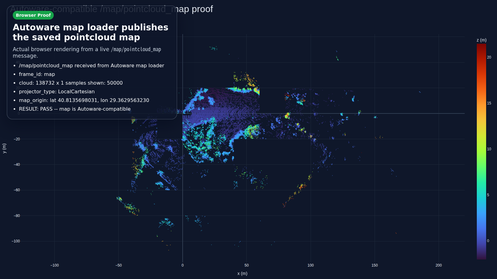

<section class="hero">
  <div class="hero__copy">
    <div class="hero__eyebrow">ROS 2 LiDAR SLAM</div>
    <h1>Turn a LiDAR bag into an Autoware-compatible pointcloud map.</h1>
    <p>
      <code>lidarslam_ros2</code> pairs the <strong>RKO-LIO</strong> frontend with the
      <strong>graph_based_slam</strong> backend, then writes a validated
      <code>pointcloud_map/</code> and <code>map_projector_info.yaml</code>.
    </p>
    <div class="hero__badges">
      <span>RKO-LIO frontend</span>
      <span>graph_based_slam backend</span>
      <span>Autoware-compatible output</span>
    </div>
    <div class="hero__actions">
      <a class="md-button md-button--primary" href="getting-started.html">Get started</a>
      <a class="md-button" href="getting-started-ja.html">日本語で始める</a>
      <a class="md-button" href="autoware-map-authoring.html">Map my bag</a>
    </div>
    <p class="hero__hint">New here? The Docker one-liner needs no ROS 2 workspace.</p>
  </div>
  <div class="hero__visual">
    
  </div>
</section>

## Pick your path

<div class="card-grid card-grid--paths">
  <a class="link-card" href="getting-started.html#docker-first-map-no-ros-2-workspace">
    <span class="link-card__step">01</span>
    <h3>Just see a map</h3>
    <p>Run a pinned Docker image on a sample MID-360 bag. No build, no ROS install.</p>
  </a>
  <a class="link-card" href="getting-started.html#3-run-your-own-bag">
    <span class="link-card__step">02</span>
    <h3>Map my own bag</h3>
    <p>Check topics and calibration with <code>lidarslam-map doctor</code>, then map it.</p>
  </a>
  <a class="link-card" href="getting-started.html#1-install-and-build-from-source">
    <span class="link-card__step">03</span>
    <h3>Build from source</h3>
    <p>Use the current candidate revision, run benchmarks, or contribute.</p>
  </a>
</div>

## Quick start

=== "Docker (no ROS 2)"

    ```bash
    mkdir -p "$PWD/lidarslam_output"
    docker run --rm \
      -e LIDARSLAM_HOST_UID="$(id -u)" \
      -e LIDARSLAM_HOST_GID="$(id -g)" \
      -v "$PWD/lidarslam_output:/lidarslam_ws/output" \
      ghcr.io/rsasaki0109/lidar_slam_ros2:v0.9.0-humble
    ```

    On Ubuntu 24.04 use `v0.9.0-jazzy`. The map lands in
    `lidarslam_output/mid360_demo`.

=== "My own bag"

    ```bash
    # Read-only preflight: no network, no files written.
    lidarslam-map doctor /path/to/rosbag2

    # Map once the doctor prints the exact start command.
    lidarslam-map start /path/to/rosbag2 --output-dir "$PWD/output/my_map"
    ```

=== "Source build"

    ```bash
    git clone --recursive https://github.com/rsasaki0109/lidar_slam_ros2.git
    cd lidar_slam_ros2
    bash scripts/source_quickstart.sh --dry-run
    ```

## What you get

A run produces a portable map bundle that Autoware tooling can load directly:

```text
output/my_map/
├── pointcloud_map/            # tiled PCD map
├── map_projector_info.yaml    # local map projection
└── ...                        # trajectory, config, and verification reports
```

Open the result in the browser-first [Autoware Foxglove path](autoware-foxglove.md)
or read the [Autoware-Compatible Map Authoring](autoware-map-authoring.md) guide.

## Learn more

<div class="card-grid">
  <a class="link-card" href="autoware-map-authoring.html">
    <h3>Autoware map authoring</h3>
    <p>The supported public path from bag to validated map bundle.</p>
  </a>
  <a class="link-card" href="workflows.html">
    <h3>Operator workflows</h3>
    <p>Required topics, optional GNSS, packet paths, and map-save flows.</p>
  </a>
  <a class="link-card" href="degeneracy-guide.html">
    <h3>Degeneracy guide</h3>
    <p>Recover tunnels, fog, and corridors where LiDAR-only SLAM can drift.</p>
  </a>
  <a class="link-card" href="benchmarking.html">
    <h3>Benchmarking</h3>
    <p>Run the tracked benchmark suite and reproduce published reports.</p>
  </a>
  <a class="link-card" href="comparison.html">
    <h3>Comparison</h3>
    <p>Current public position and benchmark-backed configuration summary.</p>
  </a>
  <a class="link-card" href="product-contract.html">
    <h3>Product contract</h3>
    <p>Supported inputs, outputs, entrypoints, and explicit non-goals.</p>
  </a>
</div>

## At a glance

| Area | Current public position |
| --- | --- |
| Main path | `RKO-LIO` + `graph_based_slam` |
| Map output | `pointcloud_map/` + `map_projector_info.yaml` |
| Long-loop evidence | `MID360` |
| Ground-truth benchmark | `NTU VIRAL tnp_01` |

## Project

- [Releases](releases/v0.9.1.md) · [v0.9.0 stable](releases/v0.9.0.md)
- [Product roadmap](roadmap/v0.9.md)
- [Operational reliability](operational-reliability.md) · [v1.0 readiness](v1-readiness.md)
- [Contributing](https://github.com/rsasaki0109/lidar_slam_ros2/blob/develop/CONTRIBUTING.md) · [Support](https://github.com/rsasaki0109/lidar_slam_ros2/blob/develop/SUPPORT.md) · [Security](https://github.com/rsasaki0109/lidar_slam_ros2/security/policy) · [Governance](https://github.com/rsasaki0109/lidar_slam_ros2/blob/develop/GOVERNANCE.md)
