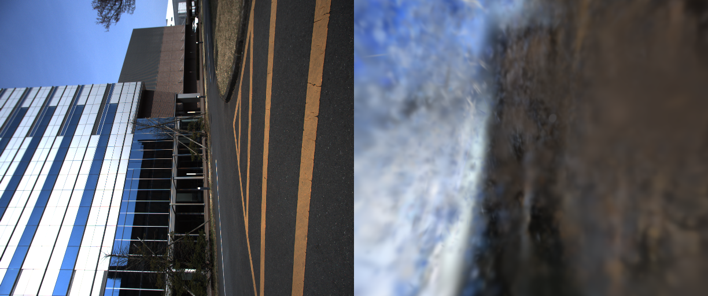

# 3DGS koide first light (2026-06-06)

`docs/research/3dgs-postprocess-map-design.md` の M1 first light を、ローカルの
`demo_data/koide_lidar_camera_calib`（Livox + 単眼カメラ同期 bag）で実走した記録。
**実 bag → SLAM → posed 画像 → 3DGS `.ply` の全鎖が通った**ことの確認。

再現: `bash scripts/run_koide_3dgs_firstlight.sh`

## パイプライン

```
demo_data/koide_lidar_camera_calib/livox/rosbag2_2023_03_09-13_42_46  (15.6s)
  │
  ├─[1] lidarslam frontend (mid360 noimu)  → traj_map_livox_frame.tum  (30 poses)
  ├─[2] extract_posed_images.py            → 30 posed images + transforms.json
  │        --time-offset auto (camera→/livox/points クロック整合: 21.88s)
  │        --extrinsic 近似 frame-convention (並進ゼロ)
  └─[3] train_gsplat.py (gsplat, 60k init, 1500 iter) → point_cloud.ply (4.1MB)
```

## 結果

| 指標 | 値 |
|---|---|
| 入力ビュー | 30（2448×2048, fl_x≈1453） |
| 学習 photometric MSE | 0.144 → 0.035（1500 iter） |
| レンダ PSNR（view 0/15/29） | 14.6 / 15.1 / 14.7 dB |
| 出力 | `point_cloud.ply`（60k gaussians, 4.1MB, INRIA 形式） |
| GPU | RTX 4070 Ti SUPER / gsplat 1.5.3 |



左が GT、右が学習済み 3DGS のレンダ（view 15）。空の青・地面の暗部・カメラ方向の
粗い構造は学習できているが、鋭いジオメトリは出ておらずブラー・ミスアライメントが残る。

## 品質が粗い要因（＝次の改善レバー、効果順）

1. **カメラ外部標定が近似** — `configs/gaussian_splatting/koide_lidar_camera_extrinsic_approx.yaml`
   は livox→camera の**フレーム規約のみ**（並進ゼロ・回転のみ）。koide は本来
   `direct_visual_lidar_calibration` 用データなので、その calib 結果を入れるのが
   最大の改善。multi-view 整合が直接効く。
2. **random init（LiDAR-primed でない）** — `train_gsplat` 既定はカメラ bounding
   sphere に random 配置。pointcloud_map / 各スキャン点で初期化すれば幾何事前が入り
   収束・shapeが大幅改善（設計の核そのもの、未実装）。
3. **frontend-only odometry のドリフト** — graph backend OFF。15s なので軽微だが
   backend ON or ループ補正で pose 品質向上。
4. **densification/pruning なし** — 最小トレーナで adaptive density control 未実装。
   gsplat の MCMC / default strategy を入れると鮮鋭度が上がる。
5. iteration/視点が少ない（1500 iter, 30 views）。

## わかったこと（実運用の知見）

- **LiDAR とカメラがセンサ内蔵クロックの別基準**だった（header stamp が ~21.9s ずれ）。
  bag 受信時刻で skew を相殺する `--time-offset auto` を実装して解決。同種の Livox+cam
  bag で再利用可能。
- `cv_bridge` は当環境の numpy 2.4.4 で ImportError。`sensor_msgs/Image` を numpy 生
  復号（`decode_image`）して回避済み。

## 次アクション

- (A) `train_gsplat` に **LiDAR-primed init**（pointcloud_map / scan 点群からの Gaussian
  初期化）と densification を追加 → 品質の本丸。
- (B) koide の **正規 extrinsic**（direct_visual_lidar_calibration）を入れて再評価。
- (C) NTU VIRAL（ステレオ + GT）で pose 品質と 3DGS 品質の相関を見る（設計 doc M2）。
